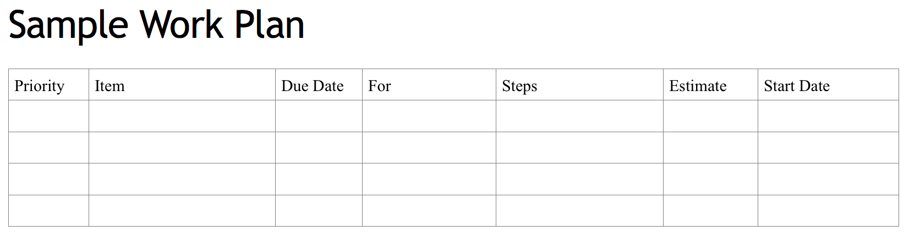
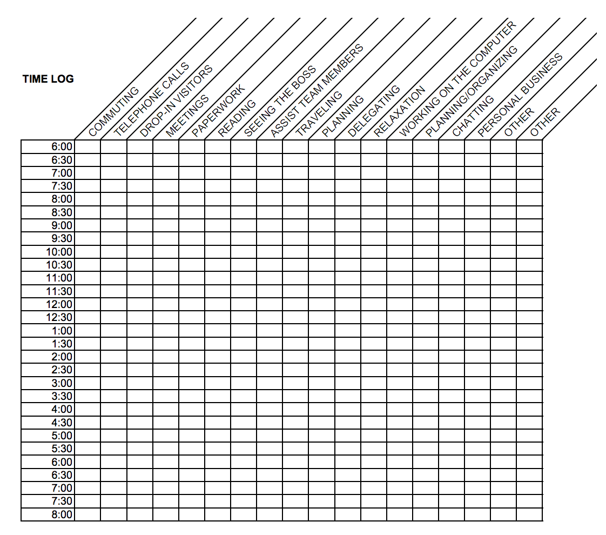
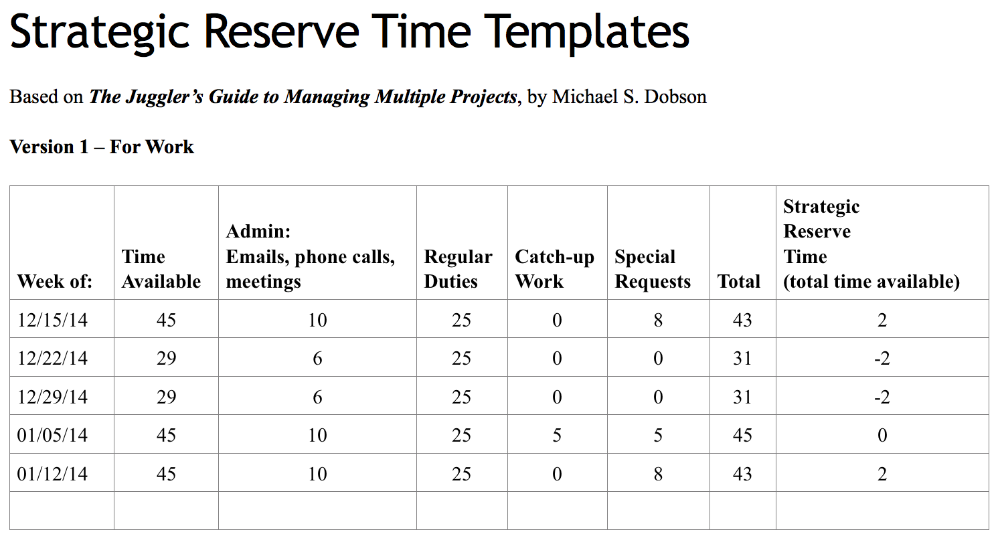
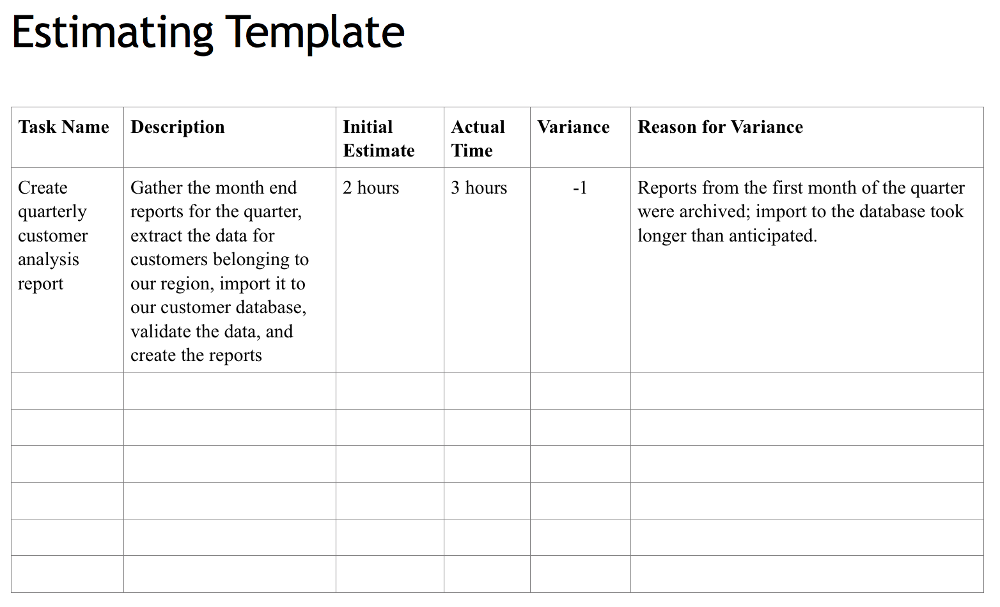
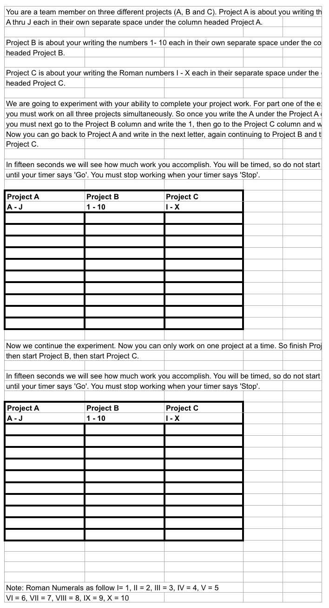
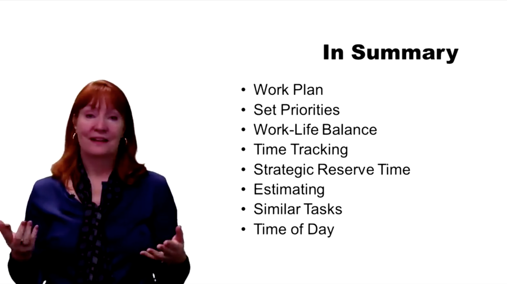

# [Work Smarter, Not Harder: Time Management for Personal & Professional Productivity](https://www.coursera.org/learn/work-smarter-not-harder/home/welcome)

# Week 1: Smart Work Habits Just Don't Happen

**Objectives**

- Describe productive vs. unproductive work
- Three ways a plan makes you more productive
- How to break up your work
- How to prioritize tasks
- Work / Life Balance
- Learn how you work

**These Steps Help to Create a Plan**

- Review job responsibilities
- Ask someone for help
- Keep notes
- Break tasks down into smaller steps

> *"A task can be considered ”large” when it is so extensive that we are tempted to put it off until ”later” whenever we see it on our list, and instead choose to do a smaller task right now."*
> 
> *"What parts of the larger task can I do by myself and which parts am I dependent on others for doing?"*
> 
> *"What easy and what difficult tasks are hiding in the big one?"*
> 
> *"Which are the first, natural steps to take right now, and which steps should definitely be taken later on?"*
> 
> *"What small, quick tasks and what larger, more complicated and time-consuming tasks are hidden in the larger task?"*
> 
> *"What different places (or systems) do I need to log into in order to do smaller tasks that are part of the big one?"*
> 
> [Reference](https://www.stiernholm.com/en/blog/how-to-divide-a-large-task-into-smaller-pieces)

**A Sample Work Plan Includes the Following Parts**

- Priority
- Description
- Due date
- Who the work is for
- Steps to take
- Estimate of time needed
- Start date

**How long will tasks take?**

- Ask a supervisor or a coworker
- Keep detailed notes
- Break large tasks down into smaller steps

> **"You don’t build the life you want by saving time. You build the life you want, and then time saves itself."**
> 
> [Reference](https://www.fastcompany.com/3037021/why-you-should-ignore-some-time-saving-tips)

> **"Taking jobs to build up your resume is the same as saving up sex for old age."**
> 
> **"You are the average of the five people you spend the most time with"**
> 
> [TED - Scott Dinsmore - How to find and do work you love](https://youtu.be/jpe-LKn-4gM)

**PRIORITIZE MOST IMPORTANT WORK FIRST**

**CREATE A PLAN; SO YOU CAN CHANGE YOUR PLANS**

# Week 2: Time Is The Most Limited Resource

*"Spend your time in the way that's gonna bring you what you want from your life."*

*"If you don't think about what you want, you don't know how to put yourself in the right situations."*

*"You teach people how to treat you."*

*"You worked really hard all day long and you were exhausted, but you weren't really sure what you did. The best way to know where your time goes is to keep track."*

*"Break down your time to at least 30 minute intervals. Honesty and discipline are the key to learning from your time tracking."*

*"At the beginning of the week, how much time do you have available? How much time do you spend on your regular duties."*

**Strategic Reserve Time** = time available to do all tasks - all commitments

# Week 3: Little Tips That Make A Big Impact
- Experience is the best tool.
- Keep good notes.
- Use tables, spreadsheets.

**Formula For Estimates** 
Initial estimate of time required to complete work **-** How long the work actually took = **VARIANCE**

**Analogous estimating:** Comparing similar finished work in order to find a time estimate to complete new work.

**Parametric estimating:** Using historical data, including variables, to estimate time to complete new work.

**Schedule Specific Time for Communication**

Expand your inbox to use multiple folders

**Classify Email by your Inbox folders**

- If it's quick to do -> Do it
- Informational email -> File it in information
- Actionable email -> File it into Action, then schedule it into your work plan and calendar
- An email reply -> File it into Pending, then create a reminder on calendar

**Keep similar information together**

- Calendars
- Contacts
- Personal items
- Work items

Schedule your most challenging work for when you are most productive

# Week 4: Let's Bring It All Together
You skip around from task to task and you're just not as effective as when you can concentrate on one thing at a time. This does not mean that you should never have more than one assignment at a time.

> **To do two things at once is to do neither.**
> 
> Publilius Syrus

And you're really not doing all of these things at the same time. You're probably going to make some kind of embarrassing mistake. What you do is you pay the price for multitasking in what we call switching cost.

**Switching cost** is the time taken to switch from one task to another, then another, and back again.

I come to you, let's say, and I say, work on task A. Then I come back 15 minutes later. I say, no, sorry, work on task B. An hour later I call you and I say, what are you doing? Would you please work on task C? And at the end of the day I come back to you. And I say, well did you ever finish task A? No? Well get on it.

Every time you go in and out of task A, you need time to reacquaint yourself with the task. Time to remember where you were, what you were doing, and what you need to do next. So this is your switching cost. And it means that although task A could take two hours, it may take you up to three if I keep pulling you in and out of it. And putting you back to work on it, and doing something else, and back and forth.

**The best approach is to try and focus on one thing at a time. Then transition to the next task.**

